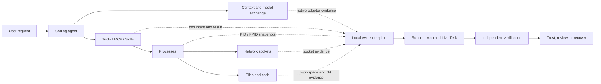

<div align="center">
  

  <h1>AgentReins</h1>

  <p><strong>Make every AI agent understandable, verifiable, and trustworthy.</strong></p>

  <p>A local-first safety and transparency companion for personal AI coding agents on macOS.</p>

  <p>
    <a href="https://github.com/yardfribley-bit/AgentReins/actions/workflows/ci.yml"></a>
    
    
    
    
  </p>
</div>

---

Coding agents can edit files, run commands, call tools, read memory, and send private context to model providers in seconds. Their logs contain activity, but often fail to answer the questions that matter after a task:

- What did I ask the agent to do?
- What context and instructions passed between the agent and the model?
- Which tools, processes, and files were involved?
- Did the result actually work?
- Where did my code and private data go?
- Can I recover safely if the agent made a mistake?

AgentReins turns those disconnected signals into one understandable, evidence-backed account of the task. It is designed as an operations console—not another log viewer. A developer should be able to open the app and immediately answer: **Which agents are running? What task is each agent executing? Which internal component is active? What changed, where did data go, and has the result been independently verified?**

## The live operations console

The current interface is deliberately layered so that useful conclusions appear before raw telemetry:

1. **Agent Fleet** — automatically discovered local agents, their live/idle state, process count, and current task summary.
2. **Agent Internals** — a readable Runtime Map derived from real PID/PPID lineage. Runtime Profiles translate opaque processes into stable responsibilities such as Agent Core, MCP Tool Server, Node REPL/Sandbox, Code Execution Host, Storage Service, and Network Service.
3. **Live Task** — a continuously updated task path from user request to context preparation, model response, MCP/Skill calls, Shell execution, file writes, build, test, agent-reported completion, and independent verification.
4. **External Services** — model providers, relays, GitHub, SSH destinations, APIs, and external content observed during the active task.
5. **Security Summary and Evidence Inspector** — the conclusion remains visible while any process, stage, file, tool, or destination can be opened for its complete evidence.

Repeated leaf processes are aggregated only when they have the same parent, Runtime Profile component, and responsibility. A row such as `MCP Tool Server ×3` remains expandable to the individual PIDs. Processes with children are never merged, so execution boundaries remain visible.

### Result semantics

AgentReins intentionally separates activity from trust:

| UI state | Meaning |
| --- | --- |
| **Running** | The process or task is active. It says nothing about safety. |
| **Observed** | A collector recorded the activity. It has not necessarily been verified. |
| **Agent reported complete** | The agent produced a completion response. The result may still be wrong. |
| **Unverified** | Evidence exists, but success cannot be proven from the available result. |
| **Verified** | An independent check—not the agent's own claim—confirmed the result. |
| **Confirmed / Inferred / Unknown** | The strength of the evidence joining an activity to an agent, turn, or tool. |

## The product direction

| Pillar | Question AgentReins should answer |
| --- | --- |
| **Trace** | What did the user ask, and what did the agent actually do? |
| **Verify** | Did the resulting code pass checks independent of the agent's own claim? |
| **Recover** | Can the complete agent turn be previewed and undone safely? |
| **Provider Trust** | Which endpoint received the user's prompts, code, files, and memory? |



## Latest progress

AgentReins is an early alpha. The repository is public so that the implementation and its limitations can be inspected directly.

### Live task and runtime visibility

- Native macOS menu bar application and industrial-style operations console.
- Automatic discovery of supported local agents, including Codex, Cursor, WorkBuddy, and Qoder adapters, with additional installed-agent presence detection.
- Agent-specific Runtime Profiles that preserve original process names while explaining each component's responsibility and security surface.
- Real PID/PPID process lineage sampled every 750 ms, scoped to Agent process trees rather than the entire machine.
- Live task reconstruction across user request, context, model, tools, MCP, Shell, file changes, build, test, reported completion, and independent verification.
- Clicking a task stage highlights its associated process ancestry; clicking a process pauses live-follow mode and exposes technical evidence.
- Startup loads live evidence and the latest active conversation only. Historical reconstruction is explicit and throttled.

### Model and tool evidence

- Per-turn user intent, model context, model response, model name, token usage, tool calls, tool arguments, and tool results when the local Agent records them.
- Native WorkBuddy evidence plus local compatibility adapters for Codex, Qoder, and Cursor.
- Cursor Composer correlation across prompts, context-token composition, model responses, tool calls/results, and generated-file security scanning.
- Tool and MCP security classification based on capability: command execution, filesystem mutation, network access, credential exposure, and external content.
- A least-privilege Chrome/Edge adapter for confirmed Grok Imagine prompt, upload, and result evidence.

### Network activity

AgentReins now combines two complementary sources instead of treating a periodic socket snapshot as complete truth:

- **Network intent evidence** is produced immediately from native Agent tool arguments. It recognizes HTTP(S), `git push/fetch/pull/clone`, SSH, SCP, rsync, curl, and wget activity.
- **Git remote resolution** reads the active workspace's `.git/config`, allowing a short `git push origin main` to be attributed to its configured host even when the socket closes between samples.
- **Socket evidence** records the owning PID, local endpoint, remote IP/host, port, and Agent process-tree attribution.
- **Proxy refinement** can replace a loopback proxy socket with the destination recorded by a supported local proxy access log.
- Each projected activity can store requested, running, completed, failed, or unverified status together with start time, end time, and duration.
- External destinations are classified as model provider, model relay, developer service, external content, telemetry, local infrastructure, or unknown.

This allows the UI to explain flows such as:

```text
Codex → Shell → git push origin main → github.com:443 → result
Codex → Shell → ssh deploy@example.com:22 → remote deployment → result
```

### File and generated-code activity

- Tool-visible file activity is normalized as Create, Read, Update, Delete, or Rename.
- File rows lead with a human-readable statement such as `Codex updated AgentOperationsCenterView.swift`, followed by a short description of the changed content.
- Tool, time, result status, attribution confidence, complete path, rename destination, arguments, before/after content, and diff remain available in the evidence inspector.
- Explicitly protected files are monitored in the background for modification or deletion, with optional restoration from a local backup.
- Changed text and generated code can be scanned locally for common security patterns.
- Git snapshots preserve repository head, staged and unstaged diff, file status, and verification context for recovery work.

### Evidence reliability

- SQLite WAL is the durable local evidence spine; live UI state is kept separate from historical reconstruction.
- Stable evidence identifiers allow a tool request to be enriched with its later result without duplicating the live activity.
- Raw evidence and derived assessments are separated, with collector health exposing failures, dropped samples, and blind spots.
- Current regression coverage includes ambiguous-attribution rejection, idempotent persistence, WAL recovery, Runtime Profile classification, Git/SSH network projection, file lifecycle projection, and a 100,000-event storage benchmark.

## What is not finished yet

These are active roadmap items, not shipping claims:

- Complete attribution from every operating-system file change to the responsible session, turn, tool call, and process.
- Git-quality separation of pre-existing user work from agent-introduced changes.
- Independent build and test verification.
- Transactional preview and undo for a complete agent turn.
- Native adapters for additional coding agents.
- Event-driven socket capture for every short-lived connection without requiring privileged Endpoint Security entitlements.
- Cross-call terminal-session correlation when a long command continues through later polling calls.
- Complete remote-host command and file evidence for SSH deployments; local socket evidence alone cannot observe the remote filesystem.
- Universal pre-execution interception or kernel-level enforcement.
- Signed and notarized public distribution.

See the [Trace, Verify, Recover roadmap](docs/TRACE-VERIFY-RECOVER-ROADMAP.md) for acceptance criteria rather than aspirational feature names.

## Build and run

### Requirements

- macOS 13 or later
- Xcode Command Line Tools
- Swift 6 toolchain

### Development build

```bash
git clone https://github.com/yardfribley-bit/AgentReins.git
cd AgentReins
swift build
swift run AgentReins
```

### Package the app

```bash
./package_app.sh
open AgentReins.app
```

The packaging script creates `AgentReins.app` in the repository root and applies an ad-hoc development signature. Distribution to other Macs without security warnings requires a Developer ID Application certificate and Apple notarization.

### Connect Grok Imagine in Chrome or Edge

1. Package AgentReins and move `AgentReins.app` into `/Applications`.
2. Run `/Applications/AgentReins.app/Contents/Resources/BrowserExtension/install-native-host.sh`.
3. Open `chrome://extensions` or `edge://extensions`, enable Developer mode, choose **Load unpacked**, and select `AgentReins.app/Contents/Resources/BrowserExtension`.
4. Open `https://grok.com/imagine`. AgentReins will show `Grok Web` after the first local evidence message arrives.

The extension requests access only to `https://grok.com/*`. It records prompt submissions, file metadata and hashes, generation status, and discovered result media. Evidence is delivered through Native Messaging; AgentReins does not expose a localhost HTTP listener.

## How the repository is organized

```text
.
├── Sources/AgentReins/
│   ├── AgentGuardApp.swift       App lifecycle and menu bar entry
│   ├── ContentView.swift         Main product interface
│   ├── AgentOperationsCenterView.swift  Live operations console
│   ├── DevelopmentTrace.swift    Task-stage reconstruction
│   ├── AgentRuntimeProfile.swift Agent-specific process responsibilities
│   ├── WorkBuddySight.swift      WorkBuddy evidence adapter
│   ├── CodexSight.swift          Codex local compatibility adapter
│   ├── CursorSight.swift         Cursor Composer compatibility adapter
│   ├── QoderSight.swift          Qoder local compatibility adapter
│   ├── WebAgentSight.swift       Browser-extension evidence adapter
│   ├── AgentSession.swift        Session and turn reconstruction
│   ├── EventStore.swift          Local normalized event storage
│   ├── EvidenceDatabase.swift    SQLite WAL evidence spine
│   ├── ProcessGuard.swift        Process observation
│   ├── NetworkSnapshotProvider.swift    PID-owned socket snapshots
│   ├── ToolActivityEvidenceProjector.swift  Network/file intent projection
│   ├── FileGuard.swift           Protected-file monitoring and recovery
│   ├── CodeSecurityScanner.swift Changed-line security checks
│   ├── MemoryScanManager.swift   Agent-memory discovery and scanning
│   └── SemanticAnalyzer.swift    Optional redacted AI analysis
├── Assets/                       Packaged application assets
├── AppIcon.iconset/              Source application icons
├── Resources/                    Runtime resources bundled with the app
├── BrowserExtension/             Least-privilege Grok Chrome/Edge extension
├── .github/workflows/            Universal 2 CI and release automation
├── docs/                         Architecture, roadmaps, and launch plans
├── Package.swift                 Swift Package Manager manifest
└── package_app.sh                Local app packaging script
```

Read [Architecture](docs/ARCHITECTURE.md) for the runtime flow, trust model, source map, and adapter contract.
See [Data Collection Architecture](docs/DATA-COLLECTION-ARCHITECTURE.md) for the evidence pipeline, the lightweight-native design decision, and why AgentReins adopts Beats-grade reliability patterns without embedding the full Beats stack.

## Privacy and trust model

- Monitoring records are stored locally.
- Optional AI analysis is disabled until the user configures a provider key.
- Common API keys, tokens, passwords, and private-key blocks are redacted locally before optional OpenRouter analysis.
- Captured evidence and inferred correlation must be labeled separately.
- Missing evidence is reported as unknown instead of being guessed.
- AgentReins does not claim access to hidden model reasoning that an agent or provider did not record.
- A client can identify where data was sent, but cannot prove that a remote server did not retain it.

## Documentation

| Document | Purpose |
| --- | --- |
| [Architecture](docs/ARCHITECTURE.md) | Runtime flow, source map, trust model, and integration contract. |
| [Data Collection Architecture](docs/DATA-COLLECTION-ARCHITECTURE.md) | Collection flow, reliability principles, and the native-versus-Beats architecture decision. |
| [Collection Reliability Assessment](docs/COLLECTION-RELIABILITY-ASSESSMENT.md) | Measured gaps, honest product claims, and hardening acceptance gates. |
| [Collection Acceptance — 2026-09-11](docs/COLLECTION-ACCEPTANCE-2026-09-11.md) | Latest measured short-term results, failures, blind spots, and deferred soak test. |
| [Trace, Verify, Recover Roadmap](docs/TRACE-VERIFY-RECOVER-ROADMAP.md) | Prioritized engineering gaps and acceptance tests. |
| [Provider Trust Roadmap](docs/PROVIDER-TRUST-ROADMAP.md) | Relay detection, outbound exposure, and model-identity boundaries. |
| [Product Hunt Launch Plan](docs/PRODUCT-HUNT-LAUNCH.md) | Positioning, launch demo, claims, and readiness checklist. |
| [Daily Development Plan](docs/DAILY-DEVELOPMENT-PLAN.md) | Today's completed work, afternoon priorities, and acceptance gates. |
| [Community Launch Copy](docs/COMMUNITY-LAUNCH-COPY.md) | Platform-specific Reddit, Hacker News, and social copy. |
| [Release Process](docs/RELEASING.md) | Universal 2 CI/CD, signing, notarization, and release instructions. |
| [Capability Test Report](docs/CAPABILITY-TEST-REPORT.md) | Automated evidence, safety gates, and capabilities that are not yet proven. |

## Contributing and feedback

AgentReins is looking for real coding-agent failure cases more than generic feature requests. Useful contributions include:

- Reproducible examples where an agent's activity log did not explain the outcome.
- Adapter research for coding-agent lifecycle and tool events.
- Tests for file attribution, Git state, interrupted turns, and safe recovery.
- Security findings with a minimal reproduction and clear impact.
- Feedback on whether a non-security expert can understand the result of one agent turn.

Please open a GitHub issue before starting a large change so the evidence model and product scope can be agreed first. Never include real API keys, private prompts, personal data, or proprietary source code in an issue.

## Project status

AgentReins is under active development and is not yet a substitute for endpoint security, backups, code review, or Git. The immediate milestone is one trustworthy end-to-end workflow that can trace a supported agent turn, verify its result independently, and recover it without damaging pre-existing work.

If this is a problem you have encountered, [open an issue](https://github.com/yardfribley-bit/AgentReins/issues) and describe the workflow you want AgentReins to make understandable.
