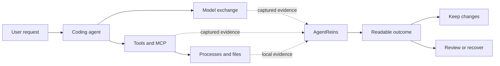

<div align="center">
  

  <h1>AgentReins</h1>

  <p><strong>See what your AI agent changed. Verify it. Undo it.</strong></p>

  <p>A local-first safety and transparency companion for personal AI coding agents on macOS.</p>

  <p>
    <a href="https://github.com/yardfribley-bit/AgentReins/actions/workflows/ci.yml"></a>
    
    
    
    
  </p>
</div>

---

Coding agents can edit files, run commands, call tools, read memory, and send private context to model providers in seconds. Their logs contain activity, but often fail to answer the questions that matter after a task:

- What did I ask the agent to do?
- What context and instructions passed between the agent and the model?
- Which tools, processes, and files were involved?
- Did the result actually work?
- Where did my code and private data go?
- Can I recover safely if the agent made a mistake?

AgentReins turns that evidence into one understandable account of the task.

## The product direction

| Pillar | Question AgentReins should answer |
| --- | --- |
| **Trace** | What did the user ask, and what did the agent actually do? |
| **Verify** | Did the resulting code pass checks independent of the agent's own claim? |
| **Recover** | Can the complete agent turn be previewed and undone safely? |
| **Provider Trust** | Which endpoint received the user's prompts, code, files, and memory? |



## What works today

AgentReins is an early alpha. The repository is public so that the implementation and its limitations can be inspected directly.

- Native macOS menu bar application and security center.
- WorkBuddy session discovery and a local compatibility adapter for Codex rollout records.
- Per-turn views of captured user intent, model context, model response, model name, token usage, tool calls, and tool results.
- Process snapshots and monitoring for explicitly protected files.
- Before-and-after evidence and recovery records for protected text files.
- Local scanning of newly changed code lines for common security patterns.
- Discovery and scanning of supported local agent-memory files.
- Natural-language protection rules.
- Optional AI summaries through a user-supplied OpenRouter key and selected model.

## What is not finished yet

These are active roadmap items, not shipping claims:

- Reliable attribution from every file change to the responsible session, turn, tool call, and process.
- Git-quality separation of pre-existing user work from agent-introduced changes.
- Independent build and test verification.
- Transactional preview and undo for a complete agent turn.
- Native adapters for additional coding agents.
- Actual network-destination and model-relay evidence.
- Universal pre-execution interception or kernel-level enforcement.
- Signed and notarized public distribution.

See the [Trace, Verify, Recover roadmap](docs/TRACE-VERIFY-RECOVER-ROADMAP.md) for acceptance criteria rather than aspirational feature names.

## Build and run

### Requirements

- macOS 13 or later
- Xcode Command Line Tools
- Swift 6 toolchain

### Development build

```bash
git clone https://github.com/yardfribley-bit/AgentReins.git
cd AgentReins
swift build
swift run AgentReins
```

### Package the app

```bash
./package_app.sh
open AgentReins.app
```

The packaging script creates `AgentReins.app` in the repository root and applies an ad-hoc development signature. Distribution to other Macs without security warnings requires a Developer ID Application certificate and Apple notarization.

## How the repository is organized

```text
.
├── Sources/AgentReins/
│   ├── AgentGuardApp.swift       App lifecycle and menu bar entry
│   ├── ContentView.swift         Main product interface
│   ├── WorkBuddySight.swift      WorkBuddy evidence adapter
│   ├── CodexSight.swift          Codex local compatibility adapter
│   ├── AgentSession.swift        Session and turn reconstruction
│   ├── EventStore.swift          Local normalized event storage
│   ├── ProcessGuard.swift        Process observation
│   ├── FileGuard.swift           Protected-file monitoring and recovery
│   ├── CodeSecurityScanner.swift Changed-line security checks
│   ├── MemoryScanManager.swift   Agent-memory discovery and scanning
│   └── SemanticAnalyzer.swift    Optional redacted AI analysis
├── Assets/                       Packaged application assets
├── AppIcon.iconset/              Source application icons
├── Resources/                    Runtime resources bundled with the app
├── .github/workflows/            Universal 2 CI and release automation
├── docs/                         Architecture, roadmaps, and launch plans
├── Package.swift                 Swift Package Manager manifest
└── package_app.sh                Local app packaging script
```

Read [Architecture](docs/ARCHITECTURE.md) for the runtime flow, trust model, source map, and adapter contract.

## Privacy and trust model

- Monitoring records are stored locally.
- Optional AI analysis is disabled until the user configures a provider key.
- Common API keys, tokens, passwords, and private-key blocks are redacted locally before optional OpenRouter analysis.
- Captured evidence and inferred correlation must be labeled separately.
- Missing evidence is reported as unknown instead of being guessed.
- AgentReins does not claim access to hidden model reasoning that an agent or provider did not record.
- A client can identify where data was sent, but cannot prove that a remote server did not retain it.

## Documentation

| Document | Purpose |
| --- | --- |
| [Architecture](docs/ARCHITECTURE.md) | Runtime flow, source map, trust model, and integration contract. |
| [Trace, Verify, Recover Roadmap](docs/TRACE-VERIFY-RECOVER-ROADMAP.md) | Prioritized engineering gaps and acceptance tests. |
| [Provider Trust Roadmap](docs/PROVIDER-TRUST-ROADMAP.md) | Relay detection, outbound exposure, and model-identity boundaries. |
| [Product Hunt Launch Plan](docs/PRODUCT-HUNT-LAUNCH.md) | Positioning, launch demo, claims, and readiness checklist. |
| [Daily Development Plan](docs/DAILY-DEVELOPMENT-PLAN.md) | Today's completed work, afternoon priorities, and acceptance gates. |
| [Community Launch Copy](docs/COMMUNITY-LAUNCH-COPY.md) | Platform-specific Reddit, Hacker News, and social copy. |
| [Release Process](docs/RELEASING.md) | Universal 2 CI/CD, signing, notarization, and release instructions. |
| [Capability Test Report](docs/CAPABILITY-TEST-REPORT.md) | Automated evidence, safety gates, and capabilities that are not yet proven. |

## Contributing and feedback

AgentReins is looking for real coding-agent failure cases more than generic feature requests. Useful contributions include:

- Reproducible examples where an agent's activity log did not explain the outcome.
- Adapter research for coding-agent lifecycle and tool events.
- Tests for file attribution, Git state, interrupted turns, and safe recovery.
- Security findings with a minimal reproduction and clear impact.
- Feedback on whether a non-security expert can understand the result of one agent turn.

Please open a GitHub issue before starting a large change so the evidence model and product scope can be agreed first. Never include real API keys, private prompts, personal data, or proprietary source code in an issue.

## Project status

AgentReins is under active development and is not yet a substitute for endpoint security, backups, code review, or Git. The immediate milestone is one trustworthy end-to-end workflow that can trace a supported agent turn, verify its result independently, and recover it without damaging pre-existing work.

If this is a problem you have encountered, [open an issue](https://github.com/yardfribley-bit/AgentReins/issues) and describe the workflow you want AgentReins to make understandable.
