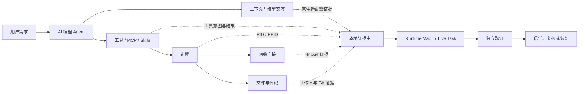

<div align="center">
  <p><a href="README.md">English</a> · <strong>简体中文</strong></p>
  

  <h1>AgentReins</h1>

  <p><strong>让每个人都能看懂、验证并信任自己的 AI Agent。</strong></p>

  <p>面向 macOS 个人 AI 编程 Agent 的本地优先安全与透明度工具。</p>

  <p>
    <a href="https://github.com/yardfribley-bit/AgentReins/actions/workflows/ci.yml"></a>
    
    
    
    
  </p>
</div>

---

AI 编程 Agent 可以在几秒钟内读取文件和记忆、调用工具、执行命令、修改代码，并将私人上下文发送给模型服务商。但任务结束后，普通日志往往无法回答真正重要的问题：

- 我让 Agent 做了什么？
- Agent 向模型发送了哪些提示词、代码、记忆和 Skill？
- 模型返回了什么，Agent 又调用了哪些工具或 MCP？
- 哪些进程、网络连接和文件变更属于这次任务？
- 我的数据最终发送到了哪里？中转服务是否可信？
- Agent 声称“完成”的结果是否真的可以运行？
- 如果 Agent 做错了，我能否安全恢复？

AgentReins 将这些分散信号组织成一条可理解、可验证、由证据支撑的任务链。它不是另一个日志查看器，而是 AI Agent 的实时运行与安全控制台。

## 实时运行控制台

界面按照“先看结论，再看证据”的方式分层：

1. **Agent Fleet**：自动发现本机 Agent，显示运行、空闲、进程数量和当前任务。
2. **Agent Internals**：根据真实 PID/PPID 关系构建 Runtime Map，将晦涩进程解释为 Agent Core、Storage Service、MCP Tool Server、Node REPL、Sandbox、Code Execution Host 和 Network Service 等职责。
3. **Live Task**：从用户需求开始，持续展示上下文准备、模型请求、MCP/Skill、Shell、文件写入、编译、测试、Agent 报告完成和独立验证。
4. **External Services**：展示模型服务商、中转节点、GitHub、SSH、外部 API 和网页内容，以及相关数据流向。
5. **Security Summary 与 Evidence Inspector**：安全结论始终可见，用户可以点击任意阶段、进程、文件、工具或网络目标查看原始证据。

## 状态语义

AgentReins 严格区分“发生过”与“可信”：

| 状态 | 含义 |
| --- | --- |
| **Running** | 进程或任务正在运行，不代表安全。 |
| **Observed** | 采集器记录到了活动，但尚未完成验证。 |
| **Agent reported complete** | Agent 自己声称任务完成，结果仍可能错误。 |
| **Unverified** | 存在相关证据，但无法证明结果成功。 |
| **Verified** | 独立检查确认结果有效，而不是采信 Agent 自己的结论。 |
| **Confirmed / Inferred / Unknown** | 活动与 Agent、会话、轮次或工具之间的归属证据强度。 |

## 核心产品方向

| 能力 | AgentReins 要回答的问题 |
| --- | --- |
| **Trace** | 用户提出了什么需求，Agent 实际做了什么？ |
| **Verify** | 产物是否通过了独立于 Agent 声明的检查？ |
| **Recover** | 能否预览并安全撤销一轮 Agent 带来的变更？ |
| **Provider Trust** | 哪个服务端点收到了提示词、代码、文件、记忆和敏感数据？ |



## 当前能力

### Agent、任务与进程

- 原生 macOS 菜单栏应用和实时态势感知控制台。
- 自动发现 Codex、Cursor、WorkBuddy、Qoder 等本地 Agent，并为其他已安装 Agent 提供存在性检测。
- Agent 专属 Runtime Profile：保留原始进程名，同时解释组件职责与安全边界。
- 每 750 毫秒采样 Agent 进程树，只关注 Agent 相关进程，而不是全机进程。
- 串联用户需求、上下文、模型、工具、MCP、Shell、文件、构建、测试与验证结果。
- 默认只加载实时证据和最近一次活动会话；历史还原需要用户明确触发，并采用节流处理。

### 模型上下文与中转安全

- 在 Agent 本地留下证据时，记录单轮用户输入、模型上下文、模型响应、模型名称、Token、成本、工具参数和工具结果。
- 区分已配置网关、实际网络候选目标和中转所声称的上游模型，避免把中转声明当成身份验证。
- 展示向上游暴露的上下文类型：用户需求、Memory、Skills/Policy、代码、项目文件和工具结果。
- 对已捕获正文检测 API Key、密码、私钥、银行卡号、身份证号和邮箱等敏感信息。
- 明确显示内容检查覆盖范围；只捕获局部正文时，不会声称完成了全量上下文审计。
- 支持 OpenAI 风格的可配置分析模型接口；未配置时不向外部模型发送本地证据。

### 工具、MCP 与外部内容

- 按能力评估工具和 MCP：命令执行、文件修改、网络访问、凭据接触和外部内容。
- 支持 Chrome/Edge 浏览器扩展，采集受支持 Web AI 的用户可见提示词、响应、联网搜索过程和上传文件元数据。
- 检查外部网页内容中的提示注入、凭据窃取诱导、隐藏文本和混淆行为。
- 不读取服务端从未展示或本地 Agent 从未保存的隐藏思维链。

### 网络与 SSH

- 从 Agent 工具参数实时识别 HTTP(S)、Git、SSH、SCP、rsync、curl 和 wget 等网络意图。
- Socket 证据记录 PID、本地端点、远端 IP/主机、端口和进程树归属。
- 对公网 IP 异步补充国家、城市、ASN 和资产运营方信息。
- 将 SSH 从单条 `IP:22` 重建为会话：Agent、用户名、认证方式、Host Key 策略、远程命令、SCP/rsync 传输和安全结论。
- 检测 Root 登录、交互式凭据、自动接受新 Host Key 和缺少实际 Socket 等风险。
- SSH 正文是加密的；命令和文件证据来自本机 Agent/工具层，Socket 只能证明连接存在。远端文件与进程需要服务器侧 Collector 才能完整证明。

### 文件、代码与记忆

- 将工具可见文件活动统一为 Create、Read、Update、Delete 和 Rename。
- 展示“哪个 Agent 修改了什么文件”，并保留路径、参数、前后内容和 Diff 等证据。
- 对变更文本和 AI 生成代码执行本地安全模式扫描。
- 监控受保护文件的修改和删除，并可从本地备份恢复。
- 识别持久化 Memory 的新增、修改和删除，展示写入内容、存储位置、Agent、Session/Turn 与归属置信度。
- Git 快照保存 HEAD、暂存/未暂存 Diff、文件状态和验证上下文。

### 证据可靠性

- SQLite WAL 是本地持久化证据主干，实时 UI 状态与历史还原分离。
- Raw Evidence 与派生安全结论分层存储。
- 稳定 Evidence ID 支持后续工具结果补全已有请求，避免重复事件。
- Collector Health 展示失败、延迟、丢弃样本和采集盲区。
- 已包含模糊归属拒绝、幂等持久化、WAL 恢复、Runtime Profile、Git/SSH、文件生命周期和 10 万事件存储基准测试。

## 当前边界

以下能力仍在开发，不属于已经完成的产品承诺：

- 将所有操作系统级文件变化完整归属到具体 Session、Turn、Tool Call 和进程。
- 区分用户原有未提交代码与 Agent 新增变更。
- 完整的独立构建、测试验证和任务级事务恢复。
- 为更多 AI 编程 Agent 提供稳定原生适配器。
- 在没有 Endpoint Security 权限的情况下捕获所有毫秒级短进程和短连接。
- 对持续运行终端命令进行跨 Tool Call 的完整关联。
- 在未安装远程 Collector 时证明 SSH 服务器上的文件与进程变化。
- 通用的内核级执行拦截。

遇到无法证明的事实时，AgentReins 会显示 **Unknown**，而不是猜测。

## 下载

正式签名并经过 Apple 公证的版本：

- [Apple Silicon](https://www.chuhaijian.com/download/apple-silicon)
- [Intel Mac](https://www.chuhaijian.com/download/intel)

官网：[www.chuhaijian.com](https://www.chuhaijian.com/)

## 构建与运行

### 环境要求

- macOS 13 或更高版本
- Xcode Command Line Tools
- Swift 6 工具链

```bash
git clone https://github.com/yardfribley-bit/AgentReins.git
cd AgentReins
swift build
swift run AgentReins
```

打包应用：

```bash
./package_app.sh
open AgentReins.app
```

## 连接 Chrome 或 Edge 扩展

1. 将 `AgentReins.app` 放入 `/Applications`。
2. 运行应用内的 Browser Extension 导出/安装流程。
3. 在 `chrome://extensions` 或 `edge://extensions` 中开启开发者模式。
4. 选择 **Load unpacked**，加载导出的扩展目录。
5. 打开 Gemini、ChatGPT、Claude 或 Grok；收到第一条本地证据后，AgentReins 会显示 `Web AI`。

扩展只申请受支持 Web AI 域名权限，证据通过 Native Messaging 保存在本地，不开放 localhost HTTP 服务。

## 项目结构

```text
.
├── Sources/AgentReins/       macOS 应用、采集器、适配器与界面
├── Tests/AgentReinsTests/    单元、关联和可靠性测试
├── Assets/                   品牌和应用资产
├── BrowserExtension/         Chrome/Edge Web AI 适配器
├── Resources/                应用运行资源
├── docs/                     架构、路线图和发布文档
├── .github/workflows/        CI 与发布自动化
├── Package.swift             Swift Package 配置
└── package_app.sh            本地应用打包脚本
```

进一步阅读：

- [系统架构](docs/ARCHITECTURE.md)
- [数据采集架构](docs/DATA-COLLECTION-ARCHITECTURE.md)
- [Trace、Verify、Recover 路线图](docs/TRACE-VERIFY-RECOVER-ROADMAP.md)

## 隐私与信任模型

- 监控证据默认保存在用户本机。
- 用户配置分析模型前，不会启用可选的 AI 分析。
- 外部分析启用时，敏感字段应先在本地识别并进行策略处理。
- 原始证据与推断结论严格区分。
- 无法采集的内容明确标记为 Unknown。
- 客户端可以证明数据发送到了哪里，但无法证明远程服务商没有保留数据。

## 反馈

欢迎通过 [GitHub Issues](https://github.com/yardfribley-bit/AgentReins/issues/new) 提交问题、证据缺口和 Agent 适配需求。
