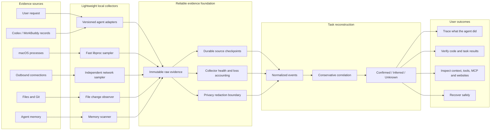
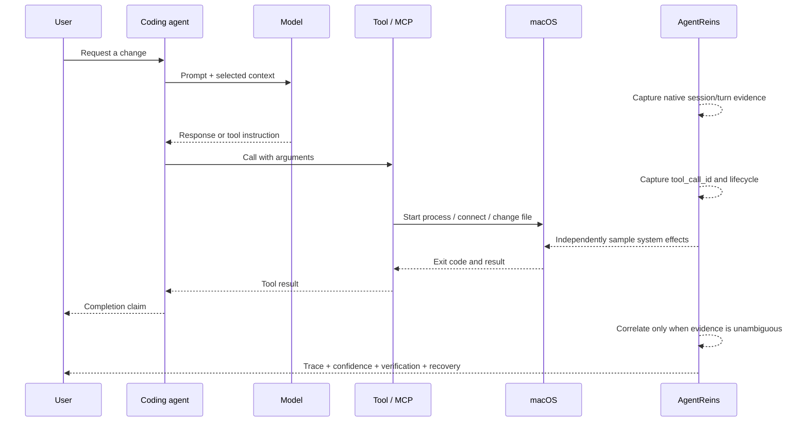

# AgentReins Data Collection Architecture

## Why this architecture exists

Personal coding agents operate across several layers at once. The user request and model exchange live in agent records, while the resulting process, network, file, Git, and memory effects live on the computer. No single collector can explain the complete task.

AgentReins therefore uses a **local, layered evidence pipeline**: native agent records explain intent, operating-system observations independently verify effects, and conservative correlation connects them without presenting guesses as facts.

## How one agent action becomes trustworthy evidence

## Why AgentReins does not embed the full Beats stack

Beats provides excellent patterns for durable offsets, backpressure, disk queues, retries, schemas, and operational health. AgentReins should adopt those patterns in its evidence foundation.

Embedding Filebeat, Packetbeat, and Auditbeat in the consumer desktop application would not solve the central product problem:

- Filebeat transports log records; it does not explain which agent turn caused a file mutation.
- Packet capture observes traffic, but encrypted payloads and short-lived connections still do not reveal model context or tool causality.
- Periodic process inventory is still sampling and can miss short-lived execution.
- None of the Beats can reconstruct user intent, model requests, tool calls, MCP lifecycle, memory use, or requirement completion without agent-specific adapters.
- Multiple background daemons, packet-capture permissions, storage, and tuning conflict with a low-friction personal macOS product.

The architectural decision is therefore:

> **Use a native lightweight collector in the desktop product, implement Beats-grade durability and observability, and keep a future Beats/Elastic export or enterprise sensor as an optional integration—not the product's mandatory runtime.**

## Collection strategy by layer

| Evidence layer | Primary source | Independent source | Reliability meaning |
| --- | --- | --- | --- |
| User and model context | Native agent session records | Provider metadata when available | Strong identity when native session and turn IDs exist. |
| Tool and MCP calls | Native tool lifecycle records | Process/network/file effects | Tool intent can be confirmed; its OS effect is independently observed. |
| Processes | Fast `libproc` snapshots | Future Endpoint Security provider | Current evidence is sampled; short execution may be missed. |
| Network | Independent low-frequency socket snapshots | Tool URLs and proxy destination metadata | PID ownership is observed; domain and tool causality may be inferred. |
| Files and Git | File/Git state comparison | Native tool records | Mutation is observed; responsible turn requires explicit evidence or conservative correlation. |
| Memory | Known memory stores and agent records | Before/after content evidence | Reads and commits are reported only when exposed by a supported source. |

## Problems this architecture solves

1. It reconstructs the complete human story instead of showing an undifferentiated log stream.
2. It distinguishes what the agent claimed from what the computer independently observed.
3. It connects prompts, model responses, tools, MCP, processes, websites, files, Git, memory, and results into one task.
4. It makes uncertainty explicit so missing evidence cannot silently become a confident security conclusion.
5. It keeps sensitive development evidence local and avoids requiring a model-provider API key for basic collection.
6. It creates one stable evidence contract that can support code safety, context safety, supply-chain safety, provider trust, verification, and recovery.

## Reliability principles

- **Raw before derived:** preserve source evidence before generating summaries or incidents.
- **At-least-once ingest, exactly-once projection:** durable checkpoints plus stable source identities make replay safe.
- **No silent failure:** permission, parsing, rotation, lag, and dropped-event failures are data.
- **No false causality:** every relationship is `confirmed`, `inferred`, or `unknown`.
- **Sampling is labeled:** snapshots never become “complete activity” claims.
- **Collection has a budget:** process, network, disk, and UI work are independently scheduled and measured.
- **Privacy is a boundary:** redact secrets before persistence, diagnostics, analysis, or export.
- **Platform sources are replaceable:** native adapters sit behind contracts so future ESF and Windows ETW collectors do not change the product model.

## Current implementation and next hardening step

The current macOS implementation already separates agent adapters, process snapshots, network snapshots, file monitoring, normalization, and correlation. Process and network collection now run on independent schedules so frequent process observation does not require frequent `lsof` execution.

The next hardening milestone is the reliable evidence spine: versioned immutable envelopes, SQLite WAL persistence, transactional source checkpoints, provider health metrics, integrity hashes, and restart/rotation/fault-injection tests. Until those gates pass, AgentReins describes OS evidence as sampled and cross-layer relationships as inferred unless native identifiers prove them.

